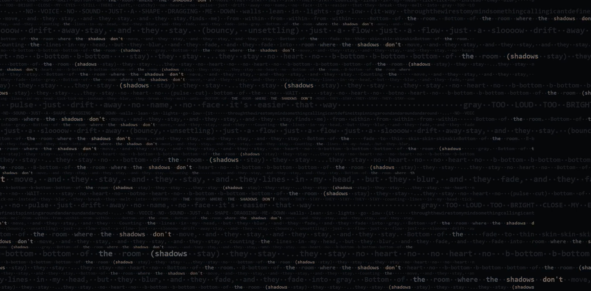

# ASCII Song Visualiser

Audio-reactive ASCII video generator. Fills the entire screen with the song's lyrics; the actively "sung" word lights up in orange, while the other tracks (kick, bass, pad, lead) modulate the background. Output: `1920×1080 @ 30 fps` MP4 with mixed audio.



Two versions:

| Script | Input | Use case |
| --- | --- | --- |
| [`ascii_video_FINAL.py`](ascii_video_FINAL.py) | 5 separate stem tracks (`kick`, `pad`, `bass`, `lead`, `vox`) | Finished song with the mix already split into stems |
| [`ascii_video_MIX.py`](ascii_video_MIX.py) | 1 complete mixdown (WAV/MP3/FLAC) | When you only have the final mix — the script does HPSS + frequency split into 5 virtual stems |

## Visual

The active word (a cursor advances through the grid driven by the vocal track) glows orange `(220, 130, 55)`, the rest stays muted monochrome `(95, 100, 108)`. The background pulses with bass and pad, kick onsets create short flashes. Rows scroll horizontally with a wave-shaped speed profile, and every 6th row scrolls in the opposite direction. Per-row font sizes create a chaotic typographic composition.

## Requirements

- **Python 3.9+**
- **ffmpeg** in `PATH` (used to merge frames + audio into the final MP4)
- Python packages — see [`requirements.txt`](requirements.txt):
  - `librosa` (feature extraction, HPSS, STFT)
  - `numpy`
  - `Pillow` (frame rendering)
  - `soundfile` (only the `FINAL` version — writes the mixed audio file)

Install:

```bash
pip install -r requirements.txt
```

ffmpeg on Windows: download from [ffmpeg.org](https://ffmpeg.org/download.html) and add it to PATH. On Linux: `apt install ffmpeg`. On macOS: `brew install ffmpeg`.

## Usage

### MIX version — single mixdown

1. Drop the final mix next to the script as `mix.wav` (or change `MIX_PATH` in the config block at the top of the script).
2. Edit the `LYRICS = """..."""` block — paste the song lyrics. Square-bracket markers like `[Intro]`, `[Drop]` are stripped out.
3. Run:
   ```bash
   python ascii_video_MIX.py
   ```
4. Output: `ascii_output.mp4`.

The script derives 5 "virtual stems" from the mix:

| Virtual stem | Source |
| --- | --- |
| kick | HPSS percussive component, 20–150 Hz |
| bass | 60–300 Hz |
| pad | 300–1500 Hz |
| lead | 1500–4000 Hz |
| vox | HPSS harmonic component, 200–3000 Hz |

### FINAL version — separate stem tracks

1. Place five WAV files next to the script:
   - `track1_kick.wav`
   - `track2_pad.wav`
   - `track3_bass.wav`
   - `track4_lead.wav`
   - `track1_vox.wav`
2. Edit `LYRICS` in the config block.
3. Run:
   ```bash
   python ascii_video_FINAL.py
   ```
4. Output: `ascii_output.mp4` + `mixed.wav` (the merged audio).

If your filenames differ, edit the `TRACKS` list at the top of the script.

## Configuration

Everything is tuned at the top of each script (under `# ============ CONFIG ============`). Key values:

### Resolution and timing
```python
FPS = 30
WIDTH, HEIGHT = 1920, 1080
COLS, ROWS = 192, 54        # logical character grid
```

### Colors
```python
COLOR_DARK   = (10, 11, 14)      # filler / background
COLOR_MID    = (95, 100, 108)    # regular text (muted gray)
COLOR_ACCENT = (220, 130, 55)    # active word (orange)
BG_COLOR     = (6, 7, 10)
ACCENT_THRESHOLD = 0.55          # above this intensity, color shifts from gray to orange
```

### Sensitivity (per-stem gains)
```python
GAIN_PAD          = 1.6     # pad → background noise pulse
GAIN_KICK         = 0.32    # kick onset → flash
KICK_THRESHOLD    = 0.45
GAIN_BASS_GLOBAL  = 0.55    # bass → global brightness boost across the WHOLE screen
GAIN_LEAD         = 0.10    # lead → subtle global modulation
GAIN_VOX_BOOST    = 0.40    # vox RMS → boost on the active word
VOX_THRESHOLD     = 0.12    # below this, the active word stays unlit (no vocals)
SMOOTH_ALPHA      = 0.55    # temporal smoothing (0=none, 1=maximum)
```

### Row scrolling
```python
SCROLL_ENABLED       = True
SCROLL_SPEED_MIN     = 0.10   # slowest rows (chars/frame)
SCROLL_SPEED_MAX     = 1.5    # fastest rows
SCROLL_PEAK_FRACTION = 0.33   # vertical position of the speed peak (0=top, 1=bottom)
SCROLL_REVERSE_EVERY = 6      # every Nth row scrolls in reverse
```

### Per-row font sizes
```python
FONT_SIZE_PATTERN = [16, 14, 22, 18, 13, 28, 15, 19, 14, 24, 17, 13]
FONT_SIZE_MIN     = 12
FONT_SIZE_MAX     = 32
```

The pattern cycles through all 54 rows. Larger font = the row takes up more vertical space and contains fewer characters.

### Lyrics sync
```python
LYRICS_TIMING = "vox_gated"     # recommended
```
- `linear` — words spread evenly across the full audio length (ignores pauses → drifts out of sync on longer tracks).
- `vox_gated` — the cursor only advances while vocals are playing and holds during pauses. **Recommended.**
- `vox_onset` — advances on individual vocal onsets (precise but sensitive to detection quality).

## How it works internally

1. **Feature extraction** — for each stem (or virtual band in the MIX version), the script computes per-frame RMS energy and onset strength.
2. **Lyrics layout** — the text is parsed into words and tiled across the entire `192×54` grid (cyclically if the text is short); the position of each word occurrence is recorded.
3. **Intensity field** — for every frame an intensity matrix `(54, 192)` is assembled:
   - bass adds a global boost,
   - pad creates a pulsing noise background,
   - kick onsets add a flash,
   - while vocals are active, the cursor advances through the grid and lights up **every occurrence** of the current word across the whole grid (plus a short 4-word trail).
4. **Rendering** — a multiprocessing pool draws each frame via Pillow + a monospace font, mapping intensity to color through a 32-level LUT (DARK → MID → ACCENT).
5. **ffmpeg** — frames + audio → H.264/AAC MP4.

Rendering is CPU-bound and parallelized across `mp.cpu_count() - 1` workers. Frames are written to `frames/` on disk (delete them after the render — the MP4 no longer needs them).

## Tips

- **First run is slow** because of HPSS/STFT extraction. On long songs (5+ min) feature extraction alone can take several minutes.
- **Disk space** — `1920×1080` PNG frames take roughly 200–500 MB per minute of video. Delete them after `ffmpeg` finishes.
- **If the active word drifts out of sync**, try `LYRICS_TIMING = "vox_onset"` or raise `VOX_THRESHOLD`. For the MIX version it helps if the vocal sits prominently in the 200–3000 Hz band.
- **If everything looks too gray/dim**, lower `ACCENT_THRESHOLD` (e.g. to `0.45`) or raise `GAIN_BASS_GLOBAL`.
- **If everything looks too orange**, do the opposite.

## License

[MIT](LICENSE)
